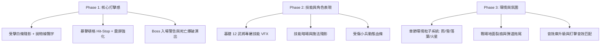

# 三國：群英再起 — 戰鬥畫面與表現深度強化方案

> **ARCHIVED PLAN — 2026-08-27。** 其中數值、完成聲明與全畫面震動方案可能已過時；目前規範與工作分別見 [戰鬥渲染契約](../../standards/combat-character-render-contract.md) 與 [目前工作清單](../../work/active-backlog.md)。

> 本方案針對 Web/Canvas 像素放置 RPG 定位，從「打擊感」、「視覺層次」、「技能演出」、「戰場環境」與「資訊反饋」五大維度制定具體落地規格。

---

## 一、打擊感與動作反饋強化（Hit Feel & Action）

### 1. 多階打擊頓挫與視效疊加（Hit-Stop & Screen Impact）
- **常規攻擊**：0.03s 輕微頓格 + 受擊白閃（`hitFlash = 0.15`）+ 少量受擊火星（3~4 顆像素粒子）。
- **暴擊（Critical）**：
  - 0.08s 頓格（暫停 delta 計算）。
  - 畫面局部縮放微晃（`shake = 4~6px`）。
  - 受擊者放射狀星芒衝擊波 + 24px 大字體跳字（黃底紅邊，帶彈跳動畫）。
- **技能斬擊（Hero Ultimate）**：
  - 0.12s 慢動作/頓格。
  - 全屏微暗暗場（Dark Overlay `alpha = 0.35`，突出施法者）。
  - 施法者產生 2~3 層彩色殘影（Afterimage）。

### 2. 受擊姿態與位移反饋（Reactions & Ragdoll Light）
- **受擊後仰與擠壓拉伸**：受擊瞬間產生 `squashX: 0.2, squashY: -0.15`，隨後彈回。
- **擊退阻尼（Knockback Damping）**：近戰重擊與張飛咆哮附加平滑減速位移（而非生硬瞬移）。
- **死亡演出升級**：
  - 普通小兵：受致命傷時向後拋飛（上升 8px 後墜地）並化為像素白煙消散。
  - Boss 陣亡：連續 3 次慢速爆破特效（震屏）+ 緩慢倒地 + 掉落金色寶箱/軍資彈出演出。

---

## 二、武將專屬技能演出與視覺特效（Hero VFX & Ultimates）

目前僅 4 名武將有專屬技能邏輯，其餘皆為通用近戰/遠程。需擴充特色技能特效庫：

| 武將 | 技能名稱 | 專屬視覺表現與粒子效果 |
|---|---|---|
| **關羽** | 青龍偃月斬 | 綠金色巨大半月形斬擊弧光（半徑 60px），地面留下一道青龍裂地灼痕（持續 1.2s） |
| **張飛** | 萬夫莫敵 | 自身為中心擴散 2 道環形震地衝擊波，震飛周圍 80px 內所有敵軍並揚起環狀塵土 |
| **趙雲** | 龍膽突刺 | 連續 4 段向前穿透殘影刺擊（藍白冷光），身後留下電光拖尾粒子 |
| **諸葛亮** | 八陣東風 / 雷霆 | 敵方陣地生成八卦太極旋轉光陣，隨後天降 3 道藍紫色雷霆（連鎖閃爍） |
| **黃忠** | 百步穿楊 | 弓弦拉滿金光蓄力（0.3s），射出一道巨大貫穿金箭，沿途產生氣流旋渦粒子 |
| **曹操** | 霸者之威 | 自身周圍升起黑紫色霸王氣焰柱，全體友軍頭頂附加紫金色攻擊力提升標記 |
| **呂布** | 鬼神破滅 | 躍起至半空後重砸目標區域，方天畫戟引爆黑紅烈焰風暴（全屏強烈震動） |
| **貂蟬** | 閉月傾城 | 粉紫色花瓣旋風擴散，命中的敵軍頭頂顯示「混亂/愛心」眩暈圖示 |
| **夏侯惇** | 剛烈反噬 | 受到攻擊時身上爆出鋼鐵火花，反彈一道血色刀光斬向攻擊者 |
| **孫尚香** | 梟姬烈矢 | 連續向天空拋射 6 枚火箭，隨後如流星雨般覆蓋敵方後排（地面燃燒點） |

---

## 三、戰場動態環境與氛圍感（Battleground Atmosphere）

### 1. 動態天氣與環境粒子層（Ambient Particles）
在現有靜態背景上疊加輕量級全屏環境粒子系統（每幀消耗 < 0.5ms）：
- **章節 1~4（平原/村莊）**：隨風飄動的青草屑、落葉、隨機微風波紋。
- **章節 5~8（要塞/荒野）**：沙塵暴粒子、殘破軍旗隨風飄動、地面火把燃燒微光。
- **章節 9~12（水域/赤壁）**：江面水波反光、雨絲特效（斜向半透明線條）、霧氣層。
- **章節 13~16（雪原/西北）**：漫天飄落的雪花粒子、角色腳底呼出白氣。
- **章節 17~20（皇城/決戰）**：黑夜氛圍、飄落的火星與灰燼（Ember particles）、天空雷光閃爍。

### 2. 深度與層次感（Depth & Parallax）
- **前景遮罩（Foreground Vignette & Objects）**：邊緣偶爾出現半透明晃動的樹枝、破軍旗或近處山石（產生景深視差）。
- **地面動態破壞**：重型攻擊、Boss 重砸會在地面留下臨時的裂痕（Decal，10秒後漸漸淡出）。

---

## 四、戰鬥資訊反饋與 HUD 動效（Combat UI & Readability）

### 1. 飄字系統升級（Damage Numbers & Floating Text）
- **物理拋物線飄字**：跳字帶有隨機左右散落角度與向上初速度，避免數字重疊成一團。
- **多色態文字區分**：
  - **物理傷害**：白字/米金（普通）、金底紅邊+放大 1.4x（暴擊）。
  - **法術/技能傷害**：紫藍色（謀士技能）、綠色（毒/燃燒）。
  - **治療回血**：翠綠色帶「+」號（如 `+320`），附帶綠色光點上升粒子。
  - **防禦/格擋**：灰色縮小字體 `格擋 / MISS`。
  - **免疫/減傷**：藍色小標記。

### 2. 角色血條與能量反饋強化
- **血條殘影扣減（White Lag Bar）**：掉血時紅條立刻扣除，身後留一條白色延遲條（0.3s 後緩慢縮回），大幅增強每一下命中的「痛感」。
- **滿能量提示**：大招能量條滿時，武將腳下出現呼吸光圈，血條下方能量條發出金光脈衝提示。
- **敵方小兵簡易血條**：受傷的小兵頭頂暫時浮現 1.5s 迷你血條（未受傷時隱藏，保持畫面乾淨）。

### 3. Boss 戰專屬演出流程
1. **警報入場**：畫面微暗，出現「⚠️ 敵將來襲」紅色警告印章。
2. **登場定格**：Boss 從屏幕上方踏步進場，伴隨塵土爆發與音效。
3. **頂部大型 Boss 血條**：戰鬥上方切換出帶有頭像的正式 Boss 血條（包含血量百分比與多階段怒氣）。
4. **勝利慢鏡頭（K.O. Freeze）**：Boss 死亡最後一擊觸發 0.25s 鏡頭聚焦，全場小兵潰散逃跑。

---

## 五、音效與打擊聽覺配合（Audio Design）

> 聽覺反饋佔打擊感的 50% 以上。需將目前的 WebAudio 單音嗶嗶聲升級為豐富的合成音階或音效包：

1. **兵器碰撞音**：利刃交錯（金屬清脆聲）、鈍器打擊（沉重低音 thud）、箭矢破空（輕快 whoosh）。
2. **技能音效**：雷霆轟鳴、火焰燃燒、治癒鈴音、氣刃揮砍。
3. **戰鬥節奏音**：戰鼓節奏作為 BGM 底層，隨著 Boss 出現節奏加快。
4. **反饋音**：暴擊重音、勝利銅鑼/號角、失敗低沉哀鳴。

---

## 六、實作優先級與分階段建議

## 實際落地結果補充（2026-08-27）

- 已接入 hit-stop、受擊白閃、暴擊震屏、殘影血條、傷害飄字與狀態 VFX。
- 16 組 VFX sprite 已對應 slash/bolt/fire/petal/guard/rally/meteor/dust/soul/combo 等演出，無図片時保留幾何圖形降級。
- WebAudio 合成音效僅作 fallback，並已加入開關、清理與頁面離開時的安全處理。
## 實作狀態：多方向攻擊動畫（2026-08-27）

- 已完成 8 方向攻擊朝向：移動、攻擊與受擊方向會寫入單位狀態，不再只依賴左右翻面。
- 已完成攻擊時間軸：預備回拉 → 出招命中 → 收招回復；近戰、弓兵與謀士使用不同的手臂、弓弦、武器與技能手部動態。
- 已完成逐幀姿勢資料：攻擊過程使用 attackFrame 0～4、身體位移、縮放、傾斜、武器掃掠與方向性軌跡，角色本體圖只作為識別層。
