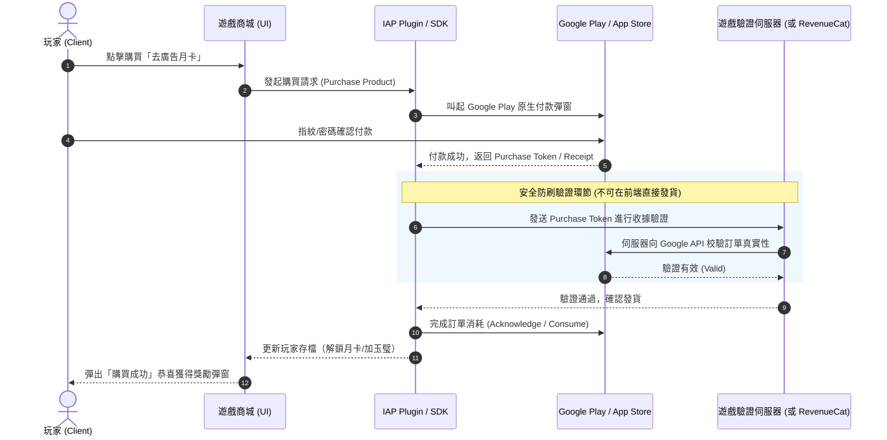

# 三國：群英再起 — 內購支付 (IAP) 與營收系統技術方案

> **ARCHIVED PLAN — 2026-08-27。** 插件、費率與商店政策可能變動，實作時必須重新查證官方文件；目前外部 IAP 工作見 [目前工作清單](../../work/active-backlog.md)。

> 本文件記錄手遊常見的支付方案評估、政策要求、技術實作架構與安全性規範，作為未來接入商業化營收的標準指南。

---

## 一、現狀檢查與問題診斷

1. **目前專案狀態**：
   - 僅有 `@capacitor-community/admob` 廣告插件。
   - 完全**沒有**接入任何內購（In-App Purchase, IAP）或第三方支付插件。
   - 程式碼中尚無商品清單、購買流程、收據驗證與防刷機制。

2. **為什麼放置遊戲需要支付系統？**
   - 放置手遊的核心商業模式為「**混合變現（Hybrid Monetization）**」：
     - **免費/輕度玩家**：激勵廣告（Rewarded Video）獲取資源、翻倍收益。
     - **付費玩家**：小額禮包、免廣告月卡、特權通行證、快速抽卡/升星資源。

---

## 二、各平台支付方案與政策合規（重要）

| 平台 / 渠道 | 允許的支付方式 | 抽成比例 | 政策注意事項 |
|---|---|---|---|
| **Google Play (Android)** | **Google Play Billing**（強制） | 15%（首 100 萬美金）/ 30% | 🚫 **禁止**在 Play 商店上架版本引導至外部金流（LinePay、綠界等），否則會直接被下架封號。部分地區支援 User Choice Billing（第三方備選）。 |
| **Apple App Store (iOS)** | **Apple StoreKit / In-App Purchase**（強制） | 15% / 30% | 🚫 虛擬道具強制使用蘋果官方內購，禁止外鏈支付。 |
| **官方 Web 網頁版 / H5 版** | **綠界 (ECPay) / 藍新 (NewebPay) / LinePay / Stripe** | ~2% - 3.5% | ✅ 純 Web 版完全自由，手續費極低，可支援信用卡、超商代碼、ATM、電子錢包。 |

> **結論**：
> - **發布 Google Play APK/AAB 時**：必須走 Google Play 內購（`@capacitor/in-app-purchase` 或 `cordova-plugin-purchase`）。
> - **發布 Web 獨立官網時**：可走台灣在地第三方金流（綠界/LinePay）。

---

## 三、常用付費產品類型規劃

| 商品分類 | 商品名稱範例 | 玩家價值（Value Proposition） | 實作難度 |
|---|---|---|:---:|
| **免廣告特權** | 去廣告通行證（永久 / 30天） | 點擊激勵廣告按鈕時直接跳過，立即領取獎勵（極高轉化率） | 🟢 低 |
| **定期訂閱 / 月卡** | 招財月卡 / 尊享月卡 | 購買立即獲得 300 玉璧，每日登入領 50 玉璧 + 離線掛機上限升至 12 小時 | 🟡 中 |
| **戰令 / 通行證** | 群英逐鹿令（Battle Pass） | 推圖解鎖關卡時，付費解鎖額外豪華道具與限定名將立繪 | 🟡 中 |
| **首充禮包** | 60 元超值首充 | 任意充值贈送強力神將（如：趙雲/方天畫戟），大幅降低前期卡關率 | 🟢 低 |
| **直接貨幣購買** | 玉璧寶箱（60 ~ 3290 元） | 階梯式定價，首次購買雙倍玉璧 | 🟢 低 |
| **限時突破禮包** | 突破成功彈出禮包 | 當玩家卡關或武將達到等級瓶頸時觸發（限時 1 小時特惠） | 🟡 中 |

---

## 四、技術接入架構

### 1. 建議技術選型

*   **Capacitor 推薦方案**：
    *   方案 A：`@revenuecat/purchases-capacitor`（**強烈推薦**：全自動處理 Google Play / iOS 收據驗證、月卡續訂狀態管理、防掉單、跨平台同步，省去自行建置驗證後端）。
    *   方案 B：`cordova-plugin-purchase`（開源免費，但需要自己架設後端 Server 驗證 Google 收據 token）。

### 2. 支付時序圖（安全標準流程）

---

## 五、防刷、掉單與安全重要守則

1.  **收據伺服器驗證（Server-side Verification）**：
    *   切勿在前端純 JS 代碼判定 `if (purchaseSuccess) save.gold += 1000`，這極易被抓包工具或記憶體修改器破解。
    *   必須完成 Google Play 的 `AcknowledgePurchase`（3天內未確認會被 Google 自動退款）。
2.  **掉單自動補發（Pending Transactions & Restore）**：
    *   遊戲每次啟動（`game-main.js`）時，自動檢查是否有「已付款但未發貨」的掛起訂單（Pending Orders），若有則立即補發。
    *   設定面板需提供「**恢復購買（Restore Purchases）**」按鈕，便於玩家換手機或重裝後恢復月卡/永久去廣告權限。
3.  **退款處理（Revocation & Negative Balance）**：
    *   如玩家惡意申請 Google 退款，後端需監聽 Google Pub/Sub RTDN（實時開發者通知），扣除對應玉璧或鎖定帳號。

---

## 六、實作分階段路線

*   **階段 1（無伺服器 MVP 版）**：
    *   先實作本地模擬商城與商品資料結構（`data/shop-data.js`）。
    *   引入 `@revenuecat/purchases-capacitor` 實現最基本的「去廣告」與「首充禮包」。
*   **階段 2（正式上架發布）**：
    *   在 Google Play Console 建立商品 ID（`sku_no_ads_permanent`, `sku_monthly_card`, `sku_jade_60` 等）。
    *   配置 Google 服務帳號金鑰與稅務/收款銀行帳戶。
*   **階段 3（多平台與進階營收）**：
    *   若有 Web 官網版，串接綠界/LinePay 實現網頁直購。
    *   加入動態限時禮包與首充翻倍機制。

## 本地原型現況（2026-08-27）

- 已建立本地商城、局部獎勵產品與原生購買／恢復橋接的誠實 fallback。
- 仍未虛構正式商店 SKU、RevenueCat 專案、收據驗證、退款回收或後端發貨；這些需發布方帳號與外部後端。
