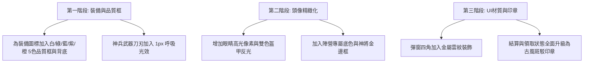

# 三國：群英再起 — 全局美術風格深度評估（大頭像、裝備道具、UI介面）

> 本文件針對遊戲四大非戰鬥視覺核心：**角色大頭貼（Avatar Portraits）**、**武器裝備圖示（Equipment Icons）**、**UI 介面與材質面板（Interface & Surfaces）** 進行全方位美術風格評估與市場對比。

---

## 一、四大視覺模組現狀評估

| 視覺模組 | 實作方式與現狀 | 優勢 (Pros) | 劣勢與痛點 (Cons) | 評級 |
|---|---|---|---|:---:|
| **1. 角色大頭貼 (Avatars)** | 純 CSS `clip-path` + 幾何線性漸變 (`linear-gradient`) 手繪拼接 | 零圖片資源載入、支援自由縮放、12名核心武將臉部特徵極具辨識度（單眼罩、綠袍紅臉、長鬚等） | ⚠️ 邊緣鋸齒感明顯、漸變色階有限、缺乏現代日韓系手遊的細節高光與眼神光，容易給人「網頁純CSS展示」的技術感而非遊戲感。 | 75分 |
| **2. 武器裝備圖 (Equipment)** | 48×48 / 64×64 粗像素圖示，透過 CSS/Canvas 繪製 | 8種兵器（青龍刀/蛇矛/方天戟）輪廓分明，4部位紙娃娃槽位分類清晰 | ❌ **缺乏品質光效框（白/綠/藍/紫/橙/紅）**、缺乏金屬高光與磨損質感，圖標過於扁平簡陋，沒有「獲得神裝」的爽感。 | 60分 |
| **3. UI 與表面家族 (UI Surfaces)** | 「古戰場軍帳紙卷」風格：深鐵灰底板 + 米黃古紙卷 + 朱砂按鈕 + 米金邊框 | 嚴格遵守三國沉穩色調，徹底避開了 SaaS 網頁表格感與現代漸變霓虹感，厚重古樸 | ⚠️ 缺乏三維物理材質紋理（如真木紋、碎金裂紋、印章墨跡散開質感），純靠 CSS gradient 模擬略顯單薄。 | 80分 |
| **4. 圖示與按鈕 (Icons & CTAs)** | 純 CSS 幾何圖形（齒輪、信封、獎章、卷軸、主城印章） | 點擊反饋明確（`translateY(2px)` + 亮度壓暗），統一金線鑲邊 | ❌ 右側功能欄圖示辨識度偏弱（純幾何形狀不易直觀理解功能），部分按鈕文字層級不夠突出。 | 70分 |

---

## 二、各模組美術升級對策與風格指南

### 1. 角色大頭貼（Avatar Portraits）美術升級
```
現狀：純 CSS 幾何塊 -> 目標：古風精緻像素立繪（Pixel Portrait with Soul）
```
*   **五官精緻化**：
    *   增加 **2px 眼睛高光點（Eye Specular Glint）**，讓角色眼神「活起來」。
    *   為頭盔、冠帶、戰甲邊緣增加 **「雙色金屬反光」**（亮黃金 + 深棕金交替）。
*   **陣營背景光環**：
    *   頭像底圖依陣營加入微弱暗紋或光暈（蜀漢翡翠綠、曹魏幽夜紫、東吳赤焰紅、群雄暗金黃）。
*   **名將邊框（Card Border Frame）**：
    *   根據稀有度（4星名將 / 5星神將）加上金屬龍紋/虎紋外框，而非單純的深色方框。

---

### 2. 武器裝備圖示（Equipment Icons）美術升級
```
現狀：簡化色塊輪廓 -> 目標：神兵寶物立體圖鑑（Tactile Artifacts）
```
*   **稀有度階層色彩系統（Rarity Spectrum）**：
    *   **凡品 (白/灰)**：粗鐵木質、無光澤。
    *   **良品 (綠色)**：精鋼打造、帶 1px 青色邊緣光。
    *   **名品 (藍色)**：淬火冷光、金屬光澤流動。
    *   **極品 (紫色)**：紫金符文纏繞、自帶呼吸微光。
    *   **神兵 (橙金)**：刀刃燃燒金炎 / 龍魂環繞 / 獨特像素動態微粒子。
*   **圖標背景槽（Icon Slot Background）**：
    *   背底加入斜向暗色絲綢底紋或古玉凹槽，讓裝備看起來像是「陳列在天鵝絨/木盒中」。

---

### 3. UI 介面與材質質感（Interface & Texture）
```
現狀：純色與簡單漸變 -> 目標：軍帳沉浸感（Tactile War-Tent Aesthetic）
```
*   **宣紙/羊皮紙質感疊加**：
    *   在面板背景（`.panel-content`）微弱疊加一張無縫像素級宣紙/竹簡噪點紋理（Paper Grain Texture，透明度 8%）。
*   **朱砂印章壓印效果（Seal Stamps）**：
    *   「已領取」、「通關」、「急報」、「勝/敗」改用紅色八角形古風印章樣式，帶有略微斑駁的印泥邊緣。
*   **金線邊框雕花（Ornate Corners）**：
    *   彈窗四角（Top-Left / Bottom-Right）加入「雲紋 / 獸面紋」金屬轉角裝飾，瞬間提升國風大作的高級感。

---

### 4. 操作反饋與動效細節（Micro-Interactions）
*   **按鈕按下反饋**：金屬按鈕按下時有下陷陰影 + 邊框金線短暫泛光。
*   **切換頁籤（Tabs）**：切換時有一道極細的金粉掃光過渡（Gold Sweep），而不是單純顏色突變。
*   **獲得獎勵演出**：彈窗背後的旋轉光芒（`reward-rays`）由純色塊改為半透明金色光暈，寶箱開蓋時彈出金色粒子。

---

## 三、執行優先級推薦


