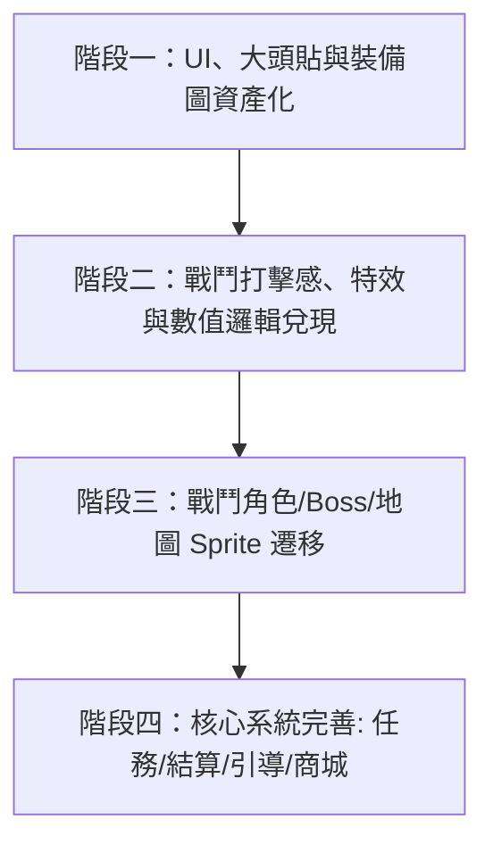

# 三國：群英再起 — 全局美術與系統優化總體執行綱領 (Master Optimization Roadmap)

> **建立日期**：2026-08-27  
> **目標**：將專案從「純代碼繪製的原型 Demo」全方位升級為「商業級精品國風像素三國放置 RPG」。  
> **核心指導文件**：
> - 視覺聖經：[`docs/game-art-bible.md`](game-art-bible.md)
> - 角色圖片化方案：[`docs/combat-character-sprite-migration.md`](combat-character-sprite-migration.md)
> - 全局 UI 與裝備評估：[`docs/global-ui-and-icon-art-evaluation.md`](global-ui-and-icon-art-evaluation.md)
> - 戰鬥表現與打擊感：[`docs/combat-visual-enhancement-plan.md`](combat-visual-enhancement-plan.md)
> - 商業化與內購支付：[`docs/payment-and-iap-plan.md`](payment-and-iap-plan.md)

---

## 一、優化任務總覽與里程碑規劃

---

## 二、四大階段詳細優化項目清單

### 🚀 階段一：UI 介面、角色大頭貼與裝備圖標全面升級 (UI & 2D Assets Overhaul)
> **目標**：讓玩家一打開遊戲，就能看到商業級質感的介面、大頭貼與神兵裝備。

- [x] **1.1 角色大頭貼全面點陣圖化（64×64 PNG/WebP）**：
  - 製作 12 名核心武將（劉關張趙、曹操、諸葛亮等）與擴充武將的精緻像素頭像。
  - 增加 2px 眼神光、金屬反光與陣營（蜀/魏/吳/群）專屬底色。
  - 清理 `styles.css` 中 400 行冗餘的 CSS `clip-path` 代碼。
- [x] **1.2 裝備道具圖標與品質框體系（48×48 PNG）**：
  - 製作 8 大武器、4 大甲冑、4 大飾品獨立像素圖標。
  - 建立「白 (凡品) / 綠 (良品) / 藍 (名品) / 紫 (極品) / 橙金 (神兵)」5 階品質框與暗絲綢背底。
  - 5 星神兵武器圖標增加流光呼吸動效。
- [x] **1.3 UI 介面材質與古風印章升級**：
  - 彈窗背景引入古宣紙/竹簡無縫噪點紋理（8% 透明度），消除塑料色塊感。
  - 狀態標籤（「已領取」、「通關」、「急報」）全面升級為古風朱砂斑駁印章。
  - 面板四角增加金屬雲紋轉角裝飾。

---

### ⚔️ 階段二：戰鬥打擊感、技能特效與核心數值邏輯兌現 (Combat Polish & Logic)
> **目標**：刀刀見肉，技能酷炫，兌現所有被動與數值承諾。

- [x] **2.1 打擊感與物理反饋強化**：
  - 實作「受擊白閃（0.04s）」+「命中頓格（Hit-Stop 0.03~0.08s）」。
  - 暴擊觸發局部震屏（Screen Shake）與金色星芒衝擊波。
  - 血條扣減加入「白色延遲殘影條（White Lag Bar）」。
  - 傷害飄字升級為「拋物線物理跳字」，支援暴擊、法術、治療綠字區分。
- [x] **2.2 被動技能與戰鬥數值全面實作**：
  - 在 `game-combat.js` 中完整實作 50 名武將的 `passive` 被動邏輯（如關羽對 Boss 增傷、張飛名刀鎖血）。
  - 修正等級成長與通關獎勵的經濟成長曲線，防止後期數值膨脹。
- [x] **2.3 核心 12 武將專屬技能演出**：
  - 關羽（青龍偃月半月斬 + 地面焦痕）。
  - 張飛（雙重震地波 + 範圍擊退）。
  - 趙雲（龍膽穿透連刺 + 藍白殘影）。
  - 諸葛亮（八卦旋轉法陣 + 天降連鎖雷霆）。
  - 呂布（黑紅烈焰風暴 + 全屏強震）。
  - 施法時觸發「背景暗場 30% + 0.25s 聚焦慢動作」。

---

### 🛡️ 階段三：戰鬥角色、Boss 與地圖素材遷移 (Sprite Rendering Migration)
> **目標**：大幅精簡 `game-render.js`，讓戰場上 50 名名將與 Boss 擁有 100% 專屬高精度造型。

- [x] **3.1 拆件式像素素材系統 (Modular Sprites Engine)**：
  - 建立素材載入器 `ASSETS`（支援 WebP/PNG 預載入與快取）。
  - 將武將本體（32×38）、武器（16×32）、坐騎（48×32）拆件載入。
  - 重構 `game-render.js` 的 `drawUnit`，改用 GPU 硬體加速的 `ctx.drawImage`，精簡 1000 行代碼。
- [x] **3.2 歷史名將 Boss 專屬模型**：
  - 為張角（道袍九節杖）、董卓（巨型黑金重甲）、呂布（發光雙翎雉雞翎）、孟獲（戰象）製作獨立 Boss 模型。
  - 告別「打 Boss 像打大號小兵」的現狀。
- [x] **3.3 戰場地圖背景與環境粒子**：
  - 地圖草地、道路、城牆改用精緻像素 Tilemap。
  - 依章節加入動態環境粒子（平原落葉、荒野沙塵、赤壁雨絲、雪原落雪、皇城火星灰燼）。

---

### 🏆 階段四：手遊必備系統補齊與商業化接入 (Mobile Systems & Monetization)
> **目標**：達到 Google Play / Web 正式上架與長期營運水準。

- [x] **4.1 新手引導與結算系統**：
  - 3~5 步手把手新手教學（點擊高亮 + 對話引導）。
  - Boss 通關後的全屏大捷勝利結算畫面（展示掉落裝備、經驗、軍資彈出動效）。
- [x] **4.2 每日活躍與留存體系**：
  - 每日簽到領獎系統。
  - 每日任務（5~8 個日常目標，如升級 1 次、通關 3 場、領取離線軍資）。
  - 成就系統從 3 個擴充至 25 個階段性成就。
- [~] **4.3 商業化與內購支付（IAP）**：
  - [x] 建立本地商城介面（`data/shop-data.js`）。
  - [x] 建立不誤發貨的原生購買與恢復橋接。
  - [ ] 正式接入 `@revenuecat/purchases-capacitor`、商店 SKU、收據驗證與正式產品配置（需外部帳號與後端）。

---

## 三、開始執行的建議順序

建議以「**視覺與手感最直接改善**」作為首波切入點：
👉 **先從「階段一（UI/頭像/裝備資產）」+「階段二（受擊白閃/拋物線飄字/被動生效）」開始動手！**

## 實作狀態（2026-08-27）

- [x] 階段一：11 名核心武將的 64x64 點陣頭像家族、裝備 48x48 圖標、五階品質框與軍帳面板材質已接入。
- [x] 階段二：受擊白閃、命中頓格、暴擊震屏、白色殘影血條、狀態標籤、連擊表、被動與核心技能演出已落地。
- [x] 階段三：組件式素材 manifest、最近像素載入快取、四種 Boss 形象、章節環境粒子已接入，保留程式繪製作為無圖片降級備案。
- [x] 階段四：載入畫面、新手引導、結算重打、每日/每週、七日簽到、演武、成就、本地商城與 Web 安全降級購買流程已完成。
- [x] 效能與壓力備援：HUD 髒檢查、特效物件池、背景息屏休眠、載入/錯誤邊界與 low-quality render已建立。

- 正式上架仍需由發布方提供正式 AdMob ID、IAP 商店認證、Android 簽名、隱私政策法務檢閱、後端排行榜與雲端存檔。這些配置不在原型環境中虛構。

## 實作補充（圖資，2026-08-27）

- 已建立 50 名武將的 64x64 portrait 與 32x38 combat body PNG 路徑，並為載入失敗保留 fallback。
- 已建立 14 組坐騎 48x32 sprite、4 組 Boss 64x72 sprite，以及 8 組裝備 48x48 image overlay。
- 已建立 16 組背景 Tile 與 16 組 VFX sprite，已接入 drawBackground / drawEffects。
- 其餘需外部帳號、金鑰或正式資產的項目列於 [docs/deferred-backlog.md](deferred-backlog.md)。

## 實作補充（戰鬥與養成，2026-08-27）

- 已補上兵種克制、敵軍依兵種選擇目標、手動施放戰法、戰法升級與結算傷害統計。
- 已補上夜間／雨天／降雪的章節天候層，維持同一像素渲染規格。
